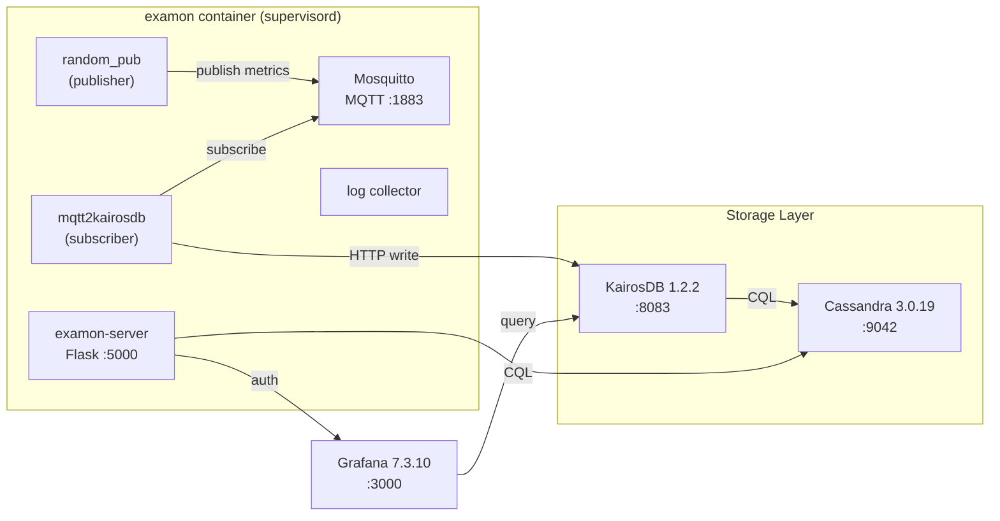
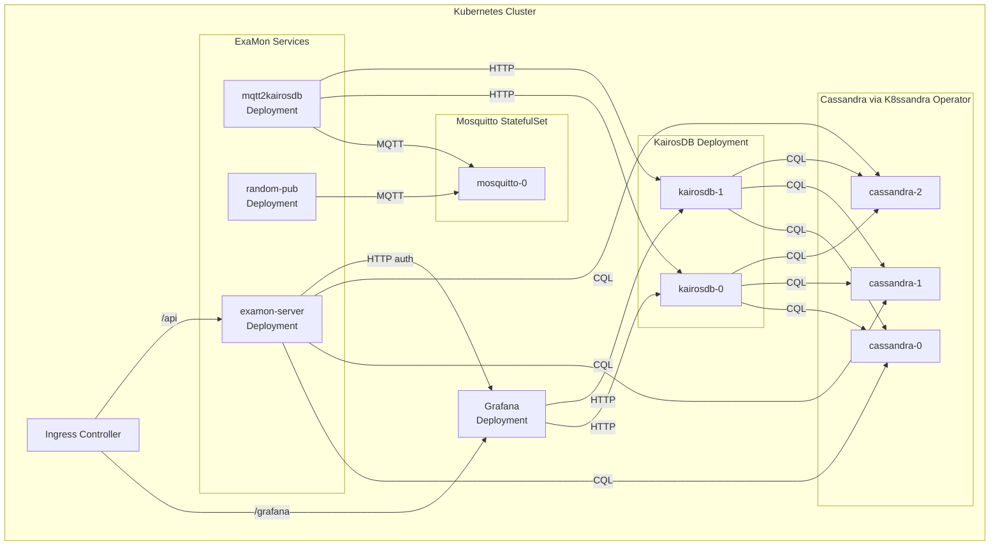

# Architecture

## Current Architecture (Docker Compose)

The v0.4.0 architecture uses Docker Compose with a monolithic "examon" container running multiple services via supervisord:



## Kubernetes Architecture (v0.5.0)

In v0.5.0, each process is decomposed into its own Kubernetes workload:



## Component Details

| Component | K8s Workload | Replicas | Stateful | Description |
|-----------|-------------|----------|----------|-------------|
| **Cassandra** | StatefulSet (K8ssandra) | 3 (prod) | Yes (PVC) | Wide-column NoSQL store, backing KairosDB |
| **KairosDB** | Deployment | 2 (prod) | No | Time-series database on top of Cassandra |
| **Grafana** | Deployment | 1 | Yes (PVC) | Dashboard and visualization |
| **Mosquitto** | StatefulSet | 1 | Optional (PVC) | MQTT broker for pub/sub messaging |
| **mqtt2kairosdb** | Deployment | 1+ | No | MQTT subscriber that writes to KairosDB |
| **random_pub** | Deployment | 1 | No | Test data publisher (optional) |
| **examon-server** | Deployment | 1-2 | No | Flask REST API for ExaMon clients |

## Data Flow

1. **Publishers** (e.g., `random_pub`, HPC node collectors) publish metrics to the **Mosquitto** MQTT broker
2. **mqtt2kairosdb** subscribes to MQTT topics and batch-writes data points to **KairosDB** via HTTP
3. **KairosDB** persists time-series data to **Cassandra** using CQL
4. **Grafana** queries **KairosDB** for visualization
5. **examon-server** reads relational/scheduler data directly from **Cassandra** and uses **Grafana** for authentication

## Helm Chart Structure

The ExaMon Helm chart uses an **umbrella chart** pattern:

```
deploy/helm/examon/
    Chart.yaml              # Dependencies: Grafana + local subcharts (K8ssandra operator installed separately)
    values.yaml             # Default configuration
    values-local.yaml       # Local K3d overrides
    values-staging.yaml     # Staging overrides
    values-production.yaml  # Production overrides
    subcharts/
        mosquitto/          # Custom Mosquitto chart
        kairosdb/           # Custom KairosDB chart
        mqtt2kairosdb/      # Custom bridge chart
        random-pub/         # Custom publisher chart
        examon-server/      # Custom API server chart
```
