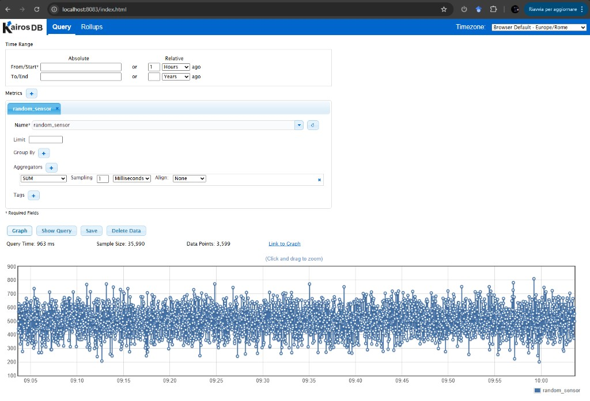

# Local Development (K3d)

Set up a complete ExaMon stack on your laptop or desktop using K3d.

## Prerequisites

Ensure you have installed all [prerequisites](prerequisites.md): Docker, K3d, kubectl, and Helm.

**Hardware:** 4 CPU cores and 8 GB RAM recommended.

## Automated Setup

The fastest way to get started:

```bash
./scripts/k8s-local-setup.sh
```

This script will:

1. Create a K3d cluster with a local image registry
2. Add the registry hostname to `/etc/hosts` (if not already present)
3. Build and push all container images
4. Install cert-manager (required by K8ssandra)
5. Install the K8ssandra operator (separate Helm release, must be ready before ExaMon)
6. Deploy the ExaMon chart (Grafana, Cassandra CR, and all ExaMon services)

## Manual Setup

### Step 1: Create the K3d Cluster

```bash
k3d cluster create --config deploy/k3d/local-cluster.yaml
```

This creates a cluster with:

- 1 server node (control plane)
- 2 agent nodes (workers)
- A local container registry at `examon-registry:5111`
- Port mappings for HTTP (8880) and MQTT (1883)

Verify:

```bash
kubectl get nodes
```

### Step 2: Register the K3d Registry Hostname

K3d creates a local container registry as a Docker container named
`examon-registry`. K3d nodes can reach it by that name via Docker networking,
but your **host machine** cannot resolve it without an `/etc/hosts` entry.
This entry is required so that `docker push` can reach the registry, and so
the image repository names match what containerd expects inside the cluster:

```bash
# Check if the entry already exists
grep examon-registry /etc/hosts

# If not present, add it
echo "127.0.0.1 examon-registry" | sudo tee -a /etc/hosts
```

!!! note
    The automated setup script (`k8s-local-setup.sh`) performs this step
    automatically. You only need to do this once per machine; the entry
    persists across cluster recreations.

### Step 3: Build and Push Images

```bash
./scripts/build-and-push-images.sh examon-registry:5111
```

### Step 4: Install cert-manager

cert-manager is required by the K8ssandra operator (its cass-operator webhooks
depend on it for TLS certificate management):

```bash
helm repo add jetstack https://charts.jetstack.io
helm repo update

helm install cert-manager jetstack/cert-manager \
  -n cert-manager --create-namespace \
  --set crds.enabled=true --wait --timeout 3m
```

### Step 5: Install K8ssandra Operator

The K8ssandra operator must be installed as a separate Helm release **before**
the ExaMon chart. The operator's validating webhook needs to be fully running
before Helm can create the `K8ssandraCluster` custom resource.

```bash
helm repo add k8ssandra https://helm.k8ssandra.io/stable
helm repo add grafana https://grafana.github.io/helm-charts
helm repo update

kubectl create namespace examon 2>/dev/null || true
helm install k8ssandra-operator k8ssandra/k8ssandra-operator \
  -n examon --wait --timeout 5m
```

The `--wait` flag ensures the operator pods and webhook endpoint are ready
before the command returns.

### Step 6: Deploy ExaMon

Update Helm dependencies (pulls Grafana chart and packages local subcharts):

```bash
cd deploy/helm/examon
helm dependency update
cd ../../..

helm install examon ./deploy/helm/examon \
  -f ./deploy/helm/examon/values-local.yaml \
  -n examon --wait --timeout 10m
```

!!! important
    After editing any subchart template (e.g. files under
    `deploy/helm/examon/subcharts/`), you **must** run `helm dependency update`
    in `deploy/helm/examon/` before upgrading. Without this step, Helm continues
    to use the previously packaged subchart `.tgz` and your template changes will
    not take effect.

### Step 7: Configure Cassandra Authentication

K8ssandra creates Cassandra with authentication enabled by default. After the
initial deployment, a superuser secret is automatically generated.

Both **KairosDB** and **examon-server** read these credentials automatically
from the K8ssandra secret via `secretKeyRef` environment variables. No
manual `--set` flags or second `helm upgrade` is needed: the pods pick up
credentials on startup once the secret exists.

`examon-server` uses env var overrides (`CASSANDRA_USER`, `CASSANDRA_PASSWORD`)
that take priority over the `server.conf` ConfigMap values. This is configured
via the `cassandraAuth.secretName` setting in values:

```yaml
examon-server:
  config:
    cassandraAuth:
      secretName: "examon-cassandra-superuser"  # K8ssandra auto-generated
```

!!! note "Bootstrap restarts"
    On a fresh install, `examon-server` and `kairosdb` may restart a few
    times while Cassandra initializes and creates the superuser secret.
    This is expected: Kubernetes restarts them automatically and they
    connect once Cassandra is ready.

### Step 8: Verify

```bash
kubectl get pods -n examon -o wide
```

All pods should reach `Running` / `Ready` status. Key things to confirm:

- **examon-cassandra-dc1-default-sts-0**: `2/2 Running` (cassandra + server-system-logger)
- **examon-kairosdb**: `1/1 Running` (connected to Cassandra)
- **examon-mosquitto-0**: `1/1 Running`
- **examon-examon-server**: `1/1 Running` (`Serving on http://0.0.0.0:5000`)
- **examon-random-pub**: `1/1 Running` (publishing test data)
- **examon-mqtt2kairosdb**: `1/1 Running` (bridging MQTT to KairosDB)

### Step 9: Verify the Data Pipeline

Once all pods are running, verify the full data pipeline
(`random_pub` → MQTT → `mqtt2kairosdb` → KairosDB → Cassandra) is working.

**Check MQTT messages** are flowing from `random_pub`:

```bash
mosquitto_sub -h localhost -p 1883 -t '#' -v
```

You should see sensor readings arriving every few seconds.

**Query KairosDB** to confirm data is reaching Cassandra. Port-forward to the
KairosDB web UI:

```bash
kubectl port-forward svc/examon-kairosdb 8083:8083 -n examon
```

Open [http://localhost:8083](http://localhost:8083), select the `random_sensor`
metric, set the time range to the last 1 hour, and click **Graph**. You
should see data points like this:



If the graph shows data, the entire pipeline is working end-to-end:
`random_pub` is publishing synthetic sensor data over MQTT, `mqtt2kairosdb`
is consuming it and writing to KairosDB, and KairosDB is persisting it in
Cassandra.

**Verify via Grafana (auto-provisioned).** Unlike the v0.4.0 docker-compose
stack, no manual datasource or dashboard setup is required:

1. Open [http://localhost:3000](http://localhost:3000) and log in as
   `admin` with the password set via `--set grafana.adminPassword=...`
   (default: `admin` for `values-local.yaml`).
2. Under **Connections → Data sources**, the `kairosdb` data source
   (type `arpnetworking-kairosdb-datasource`, `uid: examon-kairosdb`) is
   already configured. Clicking **Test** returns *"Data source is
   working"*.
3. Under **Dashboards**, open **Examon Test - Random Sensor**. It is
   loaded automatically by the Grafana dashboard sidecar from a
   chart-bundled ConfigMap labeled `grafana_dashboard=1`. The dashboard
   should render live data from `random_pub`.

If the dashboard is missing, give the sidecar ~30s to pick it up after
the initial install, then check:

```bash
kubectl get configmap -n examon -l grafana_dashboard=1
kubectl logs -l app.kubernetes.io/name=grafana -c grafana-sc-dashboard -n examon
```

## Accessing Services

All user-facing services are exposed directly on the host via the K3d load
balancer and `NodePort` services. No `kubectl port-forward` or Kubernetes
knowledge required. External clients (e.g. `examon-client` on user laptops,
admins accessing Grafana) connect to these addresses just like with Docker
Compose:

| Service | Address | Protocol | Users |
|---------|---------|----------|-------|
| MQTT broker | `<host>:1883` | MQTT | `examon-client`, publishers, subscribers |
| Grafana | `<host>:3000` | HTTP | Admins, dashboard users |
| ExaMon API | `<host>:5000` | HTTP | `examon-client`, data consumers |

Replace `<host>` with `localhost` for local access or the VM's IP/hostname
for remote access.

For internal/debugging services (not user-facing), use `kubectl port-forward`:

```bash
# KairosDB web UI (debugging only)
kubectl port-forward svc/examon-kairosdb 8083:8083 -n examon
```

## Important Configuration Details

### Cassandra Service Name

K8ssandra creates Cassandra services with a naming pattern based on the
K8ssandraCluster resource name and datacenter name. With the default ExaMon
chart configuration, the CQL service is:

```
examon-cassandra-dc1-service    (port 9042)
```

Both KairosDB and examon-server must reference this exact service name.
The umbrella chart defaults already set this correctly. If you rename the
Cassandra cluster, update the service references accordingly.

### Grafana Service Port

The Grafana Helm chart exposes port **80** on the Kubernetes service (which
proxies to the Grafana container's port 3000). When configuring
`examon-server.config.authUrl`, use port 80 (or omit the port entirely):

```yaml
examon-server:
  config:
    authUrl: "http://examon-grafana/api/datasources/id/kairosdb"
```

### KairosDB Configuration

KairosDB 1.3.0 loads two configuration files:

1. **`kairosdb.properties`**: legacy Java properties format
2. **`kairosdb.conf`**: HOCON format (takes precedence)

The `config-kairos.sh` entrypoint script patches both files at startup using
environment variables (`CASSANDRA_HOST_LIST`, `CASSANDRA_USER`,
`CASSANDRA_PASSWORD`, `KAIROS_JETTY_PORT`). The kairosdb Docker image also
includes JVM `--add-opens` flags required for KairosDB's Guice/cglib dependency
to work on Java 17+.

### Python Services Configuration (ExamonApp Framework)

`random_pub`, `mqtt2kairosdb`, and `examon-server` are Python applications
built on the `ExamonApp` framework from the `examon-common` library. They
expect their configuration in `.conf` files (INI format) mounted in the
working directory:

- `random_pub.conf`: mounted from ConfigMap via Helm
- `mqtt2kairosdb.conf`: mounted from ConfigMap via Helm
- `server.conf`: mounted from ConfigMap via Helm

These are generated from the Helm `values.yaml` settings by each subchart's
`configmap.yaml` template.

## Local Development Workflow

The inner-loop development cycle on K3d follows a simple pattern: **edit code,
rebuild the image, redeploy to the cluster**. This section covers the
recommended workflow and its alternatives.

### Understanding Image Pull Behavior

K3d nodes run containerd, which maintains its own image cache independently
from your host Docker daemon. When a pod starts, containerd decides whether
to pull the image based on the Kubernetes `imagePullPolicy`:

| Policy | Behavior | Best for |
|--------|----------|----------|
| `Always` | Re-pulls from registry on every pod start | **Local development** (always gets the latest build) |
| `IfNotPresent` | Uses cached image if tag exists locally | Staging, production (stable tags) |
| `Never` | Only uses pre-imported images | Air-gapped or `k3d image import` workflows |

`values-local.yaml` sets `pullPolicy: Always` for all custom ExaMon images.
This means the standard build-push-restart cycle works reliably with the
`:latest` tag, with no stale cache surprises.

### Scenario 1: Application Code Change

When you modify application code (Python, config files, etc.) for a single
service:

```bash
# 1. Rebuild the image
docker build -t examon-registry:5111/examon/examon-server:latest \
  -f deploy/docker/examon-server/Dockerfile .

# 2. Push to the local registry
docker push examon-registry:5111/examon/examon-server:latest

# 3. Restart the deployment (containerd re-pulls from registry)
kubectl rollout restart deployment/examon-examon-server -n examon

# 4. Verify
kubectl logs -f deployment/examon-examon-server -n examon
```

This takes roughly 10-30 seconds depending on the image size.

Replace `examon-server` with the service you are working on. The mapping is:

| Service | Dockerfile | Deployment name |
|---------|-----------|-----------------|
| examon-server | `deploy/docker/examon-server/Dockerfile` | `examon-examon-server` |
| kairosdb | `deploy/docker/kairosdb/Dockerfile` | `examon-kairosdb` |
| mqtt2kairosdb | `deploy/docker/mqtt2kairosdb/Dockerfile` | `examon-mqtt2kairosdb` |
| random-pub | `deploy/docker/random-pub/Dockerfile` | `examon-random-pub` |
| mosquitto | `deploy/docker/mosquitto/Dockerfile` | `examon-mosquitto` (StatefulSet) |

For **mosquitto** (a StatefulSet), use:
```bash
kubectl rollout restart statefulset/examon-mosquitto -n examon
```

### Scenario 2: Helm Template Change

When you modify files under `deploy/helm/examon/subcharts/` (e.g., adding an
env var to a deployment template, changing a ConfigMap):

```bash
# 1. Rebuild the Helm dependency archives
cd deploy/helm/examon && helm dependency update && cd ../../..

# 2. Upgrade the release (Helm detects the template change and recreates pods)
helm upgrade examon ./deploy/helm/examon \
  -f ./deploy/helm/examon/values-local.yaml \
  -n examon --timeout 10m
```

!!! warning
    Without `helm dependency update`, Helm uses stale `.tgz` archives in
    `charts/` and your template changes will have no effect. This is the
    most common "my changes aren't working" mistake.

### Scenario 3: Helm Values Change

When you only change `values-local.yaml` (e.g., resource limits, config
parameters, replica count):

```bash
helm upgrade examon ./deploy/helm/examon \
  -f ./deploy/helm/examon/values-local.yaml \
  -n examon --timeout 10m
```

No image rebuild or dependency update is needed.

### Quick Reference

| What changed | Build image? | `helm dep update`? | Deploy command |
|-------------|:---:|:---:|----------------|
| Application code | Yes | No | `kubectl rollout restart` |
| Helm template (`subcharts/`) | No | **Yes** | `helm upgrade` |
| Helm values | No | No | `helm upgrade` |
| Both code + template | Yes | **Yes** | `helm upgrade` (picks up new image too) |

### Alternative: `k3d image import` (Without `pullPolicy: Always`)

If you are working in an environment where `pullPolicy` is set to
`IfNotPresent` (e.g., debugging in staging), the registry push alone will
not update the containerd cache. Use `k3d image import` to bypass the
registry and load the image directly into all K3d nodes:

```bash
docker build -t examon-registry:5111/examon/examon-server:latest \
  -f deploy/docker/examon-server/Dockerfile .
docker push examon-registry:5111/examon/examon-server:latest

# Force-load into K3d containerd cache
k3d image import examon-registry:5111/examon/examon-server:latest \
  -c examon-local

# Restart to pick up the imported image
kubectl rollout restart deployment/examon-examon-server -n examon
```

### Alternative: Unique Tags (CI/CD Pattern)

For reproducible, traceable builds (recommended for CI pipelines and
shared staging environments), use the git commit SHA as the image tag:

```bash
TAG=$(git rev-parse --short HEAD)

docker build -t examon-registry:5111/examon/examon-server:${TAG} \
  -f deploy/docker/examon-server/Dockerfile .
docker push examon-registry:5111/examon/examon-server:${TAG}

helm upgrade examon ./deploy/helm/examon \
  -f ./deploy/helm/examon/values-local.yaml \
  --set examon-server.image.tag="${TAG}" \
  -n examon
```

This eliminates caching issues entirely because each build gets a unique
tag that containerd has never seen before.

### Optional: Automated Workflows with Tilt or Skaffold

For teams that want a fully automated file-watch -> rebuild -> redeploy
loop (similar to frontend hot-reload), tools like
[Tilt](https://tilt.dev/) and [Skaffold](https://skaffold.dev/) integrate
well with K3d and Helm charts:

- **Tilt** provides a web dashboard, live-updates (sync files into running
  containers without a full rebuild), and multi-service orchestration.
- **Skaffold** is a CLI-first tool that handles the build-push-deploy
  pipeline, supports file syncing, and integrates with CI/CD.

Both tools work with ExaMon's Helm chart structure out of the box. They
are optional power-ups; the manual workflow above is sufficient for most
development tasks.

### Teardown

```bash
k3d cluster delete examon-local
```
