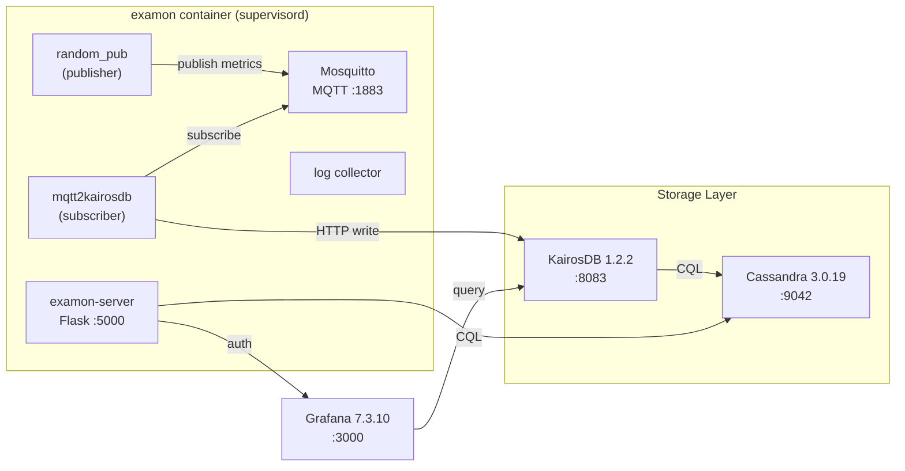
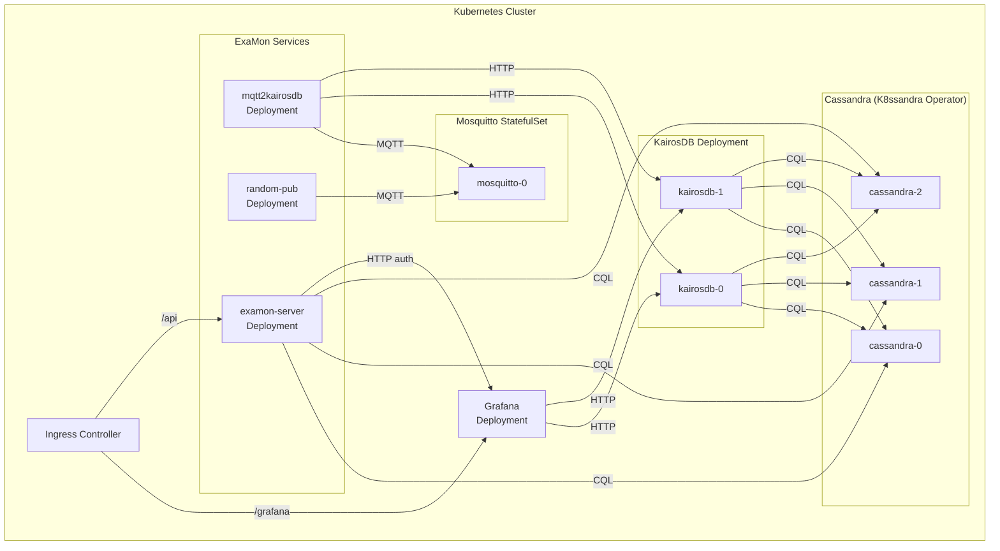

# ExaMon Kubernetes Deployment -- Technical Implementation Plan

!!! info "Status: Live (reproduced 2026-05-23)"
    Historical pre-v0.5.0 technical plan, preserved for reference. The shipped result is documented in [Administrators → Deploy](../../administrators/deploy/index.md) and the [v0.5.0 release notes](v0.5.0.md).

## 1. Current Architecture Analysis

The ExaMon platform (`[docker-compose.yml](docker-compose.yml)`) currently runs 4 Docker Compose services on a single bridge network (`examon_net`):




**Key issue:** The examon container is a **fat container** running 5 processes via supervisord. This must be decomposed into individual K8s workloads.

---

## 2. Target K8s Architecture




### Component-to-K8s Workload Mapping

- **Cassandra** -- K8ssandra Operator (CRD `K8ssandraCluster`), 3-node `StatefulSet` with `PodAntiAffinity` for HA
- **KairosDB** -- `Deployment` (stateless, 2 replicas) + `Service` (ClusterIP), uses official KairosDB Helm chart from `kairosdb/kairosdb` repo
- **Grafana** -- `Deployment` (1 replica) + `PersistentVolumeClaim` + `Service`, uses official `grafana/grafana` Helm chart
- **Mosquitto** -- `StatefulSet` (1 replica) + `PVC` for persistence + `Service` (ClusterIP + optional NodePort/LoadBalancer for external publishers)
- **mqtt2kairosdb** -- `Deployment` (1 replica, scalable) + `ConfigMap`
- **random_pub** -- `Deployment` (1 replica, optional) + `ConfigMap`
- **examon-server** -- `Deployment` (1-2 replicas) + `ConfigMap` + `Service`

---

## 3. Helm Chart Structure

An **umbrella chart** pattern with external dependencies and custom subcharts:

```
deploy/helm/examon/
  Chart.yaml                  # Umbrella chart, declares dependencies
  Chart.lock
  values.yaml                 # Default values (sensible baseline)
  values-local.yaml           # Overrides for local K3d/Kind development
  values-staging.yaml         # HA topology with minimal resources + random_pub enabled
  values-production.yaml      # Full production resources, TLS, backups
  charts/                     # Downloaded dependency charts (gitignored)
  templates/
    _helpers.tpl              # Shared template helpers
    namespace.yaml            # Optional namespace creation
    NOTES.txt                 # Post-install instructions
  subcharts/
    mosquitto/
      Chart.yaml
      templates/
        statefulset.yaml
        service.yaml
        configmap.yaml
        pvc.yaml
      values.yaml
    mqtt2kairosdb/
      Chart.yaml
      templates/
        deployment.yaml
        configmap.yaml
      values.yaml
    random-pub/
      Chart.yaml
      templates/
        deployment.yaml
        configmap.yaml
      values.yaml
    examon-server/
      Chart.yaml
      templates/
        deployment.yaml
        service.yaml
        configmap.yaml
        secret.yaml
      values.yaml
```

### `Chart.yaml` Dependencies

```yaml
apiVersion: v2
name: examon
version: 0.5.0
appVersion: "0.5.0"
dependencies:
  - name: k8ssandra-operator
    version: "~1.30"
    repository: https://helm.k8ssandra.io/stable
    condition: cassandra.enabled
  - name: grafana
    version: "~8.x"
    repository: https://grafana.github.io/helm-charts
    condition: grafana.enabled
  - name: mosquitto
    repository: "file://subcharts/mosquitto"
    version: "0.1.0"
    condition: mosquitto.enabled
  - name: mqtt2kairosdb
    repository: "file://subcharts/mqtt2kairosdb"
    version: "0.1.0"
    condition: mqtt2kairosdb.enabled
  - name: random-pub
    repository: "file://subcharts/random-pub"
    version: "0.1.0"
    condition: random-pub.enabled
  - name: examon-server
    repository: "file://subcharts/examon-server"
    version: "0.1.0"
    condition: examon-server.enabled
```

**KairosDB note:** The official KairosDB Helm chart (in `kairosdb/kairosdb` repo under `deployment/helm/`) may be vendored or wrapped as a custom subchart, since it is not published to a standard Helm repository. Evaluate during implementation whether to vendor it or build a custom one.

---

## 4. Container Image Strategy

### External Repository Analysis

The monolithic examon container is composed from two external repos (referenced in [v0.5.0 release notes](v0.5.0.md)):

**examon-container** ([https://github.com/ExamonHPC/examon-container](https://github.com/ExamonHPC/examon-container)):

- Base image: `python:3.12` (Debian bookworm)
- Installs system packages: mosquitto, supervisor, ipmitool, snmp tools, sshpass, pypy3
- Layout: `examon_deploy/examon/` contains `broker/` (mosquitto.conf), `subscribers/mqtt2kairosdb_queue/`, `scripts/` (frontend_ctl.sh, examon.conf), `lib/`
- Installs `examon-common` via `pip install git+https://github.com/ExamonHPC/examon-common.git@v0.2.6` into a **pypy3 virtualenv**
- `frontend_ctl.sh` simply sources `examon.conf` and runs `/usr/bin/supervisord`

**examon-common** ([https://github.com/ExamonHPC/examon-common](https://github.com/ExamonHPC/examon-common)):

- Python package v0.2.7, modules: `examon.plugin`, `examon.utils`, `examon.db`, `examon.transport`
- Key dependencies: `paho-mqtt==1.6.1`, `requests==2.32.3`, `psutil==6.1.1`
- Required by both `mqtt2kairosdb` (needs `examon-common>=0.2.5`) and `random_pub` (needs `examon-common>=0.1.0`)

**mqtt2kairosdb** config (`mqtt2kairosdb.conf`) -- this becomes a K8s ConfigMap:

```ini
[MQTT]
MQTT_BROKER = 127.0.0.1    # -> mosquitto service DNS
MQTT_PORT = 1883
MQTT_TOPIC = org/#

[KairosDB]
K_SERVERS = 127.0.0.1      # -> kairosdb service DNS
K_PORT = 8083

[Daemon]
NUM_WORKERS = 4
LOG_LEVEL = INFO
```

**Mosquitto** config (`mosquitto.conf`):

```
persistence false
max_inflight_messages 0
max_queued_messages 0
max_connections -1
listener 1883 0.0.0.0
allow_anonymous true
```

### New Dockerfiles

Each process is extracted into its own container. New Dockerfiles live in `deploy/docker/`:


| Service       | Base Image               | Source                                                                                   | Notes                                                                                                     |
| ------------- | ------------------------ | ---------------------------------------------------------------------------------------- | --------------------------------------------------------------------------------------------------------- |
| mosquitto     | `eclipse-mosquitto:2`    | Official image                                                                           | ConfigMap mounts `mosquitto.conf`                                                                         |
| mqtt2kairosdb | `python:3.12-slim`       | `examon-container` repo `subscribers/mqtt2kairosdb_queue/` + `examon-common` from GitHub | Match base image python:3.12; install examon-common via pip from GitHub; ConfigMap for mqtt2kairosdb.conf |
| random_pub    | `python:3.12-slim`       | This repo `publishers/random_pub/` + `examon-common`                                     | Same pattern; `examon-common>=0.1.0`                                                                      |
| examon-server | `python:3.12-slim`       | This repo `web/examon-server/`                                                           | Deps: Flask, waitress, cassandra-driver, pandas (from `web/examon-server/requirements.txt`)               |
| kairosdb      | `eclipse-temurin:17-jre` | Updated from `adoptopenjdk:8` in `docker/kairosdb/Dockerfile`                            | KairosDB v1.3.0 .deb + config-kairos.sh                                                                   |


```
deploy/docker/
  mosquitto/Dockerfile          # FROM eclipse-mosquitto:2, COPY mosquitto.conf
  mqtt2kairosdb/Dockerfile      # FROM python:3.12-slim, pip install examon-common, COPY mqtt2kairosdb.py
  random-pub/Dockerfile         # FROM python:3.12-slim, pip install examon-common, COPY random_pub.py
  examon-server/Dockerfile      # FROM python:3.12-slim, pip install -r requirements.txt, COPY server code
  kairosdb/Dockerfile           # FROM eclipse-temurin:17-jre, wget kairosdb v1.3.0 .deb
```

**Important:** The current base image uses **pypy3** for mqtt2kairosdb and random_pub virtualenvs. For K8s, we standardize on CPython 3.12 (matching the examon-container base) for simplicity. If pypy3 performance is needed, it can be added as an option later.

---

## 5. K3d as the Unified Local K8s Engine

**K3d** (k3s-in-Docker) is used for both local development and staging-on-a-VM. It supports true multi-node clusters on a single machine, where each K8s "node" is a Docker container. This means:

- Pod anti-affinity rules work correctly (pods get scheduled to different k3d nodes)
- Each node gets a unique `kubernetes.io/hostname` label automatically
- Node labels can be added via `--k3s-node-label` for custom topology keys
- A built-in local registry avoids needing to push images externally
- Built-in Traefik ingress and ServiceLB come free with k3s

**Why K3d over alternatives:**

- Fastest startup (4-12s vs Kind 25-45s vs Minikube 45-120s)
- Native multi-server (HA control plane) and multi-agent (worker) support
- Built-in registry and LoadBalancer -- no extra setup
- Lowest resource overhead per node

### Prerequisites (all environments)

```bash
# Docker (required)
curl -fsSL https://get.docker.com | sh

# k3d
curl -s https://raw.githubusercontent.com/k3d-io/k3d/main/install.sh | bash

# kubectl
curl -LO "https://dl.k8s.io/release/$(curl -L -s https://dl.k8s.io/release/stable.txt)/bin/linux/amd64/kubectl"
chmod +x kubectl && sudo mv kubectl /usr/local/bin/

# Helm
curl https://raw.githubusercontent.com/helm/helm/main/scripts/get-helm-3 | bash
```

---

## 6. Local Development Environment

### Hardware Requirements

- **Minimum:** 2 CPU cores, 4 GB RAM, 20 GB disk
- **Recommended:** 4 CPU cores, 8 GB RAM, 40 GB disk
- Runs on: laptop, desktop, or any VM

### K3d Cluster Setup

A `scripts/k8s-local-setup.sh` script and a K3d config file `deploy/k3d/local-cluster.yaml`:

```yaml
# deploy/k3d/local-cluster.yaml
apiVersion: k3d.io/v1alpha5
kind: Simple
metadata:
  name: examon-local
servers: 1
agents: 2
registries:
  create:
    name: examon-registry
    hostPort: "5111"
ports:
  - port: 3000:80
    nodeFilters:
      - loadbalancer
  - port: 1883:1883
    nodeFilters:
      - loadbalancer
options:
  k3s:
    extraArgs:
      - arg: --disable=traefik
        nodeFilters:
          - server:*
```

Setup commands:

```bash
# Create cluster with local registry
k3d cluster create --config deploy/k3d/local-cluster.yaml

# Build and push images to local registry
docker build -t k3d-examon-registry:5111/examon/mqtt2kairosdb:latest -f deploy/docker/mqtt2kairosdb/Dockerfile .
docker push k3d-examon-registry:5111/examon/mqtt2kairosdb:latest
# ... repeat for all images

# Install K8ssandra operator
helm repo add k8ssandra https://helm.k8ssandra.io/stable
helm install k8ssandra-operator k8ssandra/k8ssandra-operator -n examon --create-namespace

# Deploy ExaMon
helm install examon ./deploy/helm/examon -f ./deploy/helm/examon/values-local.yaml -n examon
```

### `values-local.yaml` Key Overrides

- Cassandra: **single node** (no HA), resource requests: 512Mi RAM, 0.5 CPU
- KairosDB: **1 replica**, 256Mi RAM
- Grafana: **1 replica**, no persistence, default admin password
- Mosquitto: **1 replica**, no persistence
- All images: point to `k3d-examon-registry:5111/examon/`*
- Ingress: use Traefik (bundled with K3d/k3s)
- No TLS, no NetworkPolicies

---

## 7. Staging Environment

### Purpose

Staging mirrors the **full HA topology** of production (same replica counts, anti-affinity rules, NetworkPolicies, TLS) but with **minimal resource requests** so it can run on a single VM. It enables `random_pub` to exercise the complete data pipeline end-to-end with synthetic data, validating that all HA components work correctly before promoting to production.

### Running a Multi-Node K8s Cluster on a Single VM

K3d creates multiple K8s nodes as Docker containers inside a single VM. This is the simplest way to get a multi-node cluster for staging without any cloud infrastructure:

```
VM (e.g. 8 CPU, 16 GB RAM, 100 GB disk)
  └── Docker
       ├── k3d-examon-staging-server-0    (K8s control plane)
       ├── k3d-examon-staging-agent-0     (K8s worker node 1)
       ├── k3d-examon-staging-agent-1     (K8s worker node 2)
       ├── k3d-examon-staging-agent-2     (K8s worker node 3)
       ├── k3d-examon-staging-serverlb    (load balancer)
       └── k3d-examon-registry            (local image registry)
```

Each agent is a separate Docker container with its own `kubernetes.io/hostname`, so **pod anti-affinity works correctly** -- Cassandra pods will be scheduled across different k3d-agents, simulating real multi-node HA.

### Hardware Requirements

- **Minimum:** 4 CPU cores, 8 GB RAM, 50 GB disk
- **Recommended:** 8 CPU cores, 16 GB RAM, 100 GB disk
- Runs on: any Linux VM (cloud instance, on-prem VM, bare metal)

### K3d Staging Cluster Config

```yaml
# deploy/k3d/staging-cluster.yaml
apiVersion: k3d.io/v1alpha5
kind: Simple
metadata:
  name: examon-staging
servers: 1
agents: 3
registries:
  create:
    name: examon-registry
    hostPort: "5111"
ports:
  - port: 443:443
    nodeFilters:
      - loadbalancer
  - port: 80:80
    nodeFilters:
      - loadbalancer
  - port: 1883:1883
    nodeFilters:
      - loadbalancer
options:
  k3s:
    nodeLabels:
      - label: topology.kubernetes.io/zone=zone-a
        nodeFilters:
          - agent:0
      - label: topology.kubernetes.io/zone=zone-b
        nodeFilters:
          - agent:1
      - label: topology.kubernetes.io/zone=zone-c
        nodeFilters:
          - agent:2
```

The custom `topology.kubernetes.io/zone` labels on each agent simulate availability zones. This allows Cassandra's soft pod anti-affinity to spread pods across "zones" even on a single machine, validating the same topology-aware scheduling that production uses.

### Staging Setup Commands

```bash
# Create multi-node cluster
k3d cluster create --config deploy/k3d/staging-cluster.yaml

# Build and push images (same as local)
./scripts/build-and-push-images.sh k3d-examon-registry:5111

# Install cert-manager (for self-signed TLS)
helm repo add jetstack https://charts.jetstack.io
helm install cert-manager jetstack/cert-manager -n cert-manager --create-namespace --set crds.enabled=true

# Install K8ssandra operator
helm install k8ssandra-operator k8ssandra/k8ssandra-operator -n examon --create-namespace

# Deploy ExaMon with staging values
helm install examon ./deploy/helm/examon \
  -f ./deploy/helm/examon/values-staging.yaml \
  -n examon

# Verify HA: check pods are spread across nodes
kubectl get pods -n examon -o wide
```

### `values-staging.yaml` Key Settings

- **Cassandra (K8ssandra):**
  - **3 nodes** (same as production) for real HA validation
  - `podAntiAffinity: preferredDuringSchedulingIgnoredDuringExecution` (soft, works on k3d nodes)
  - `topologyKey: topology.kubernetes.io/zone` (uses the zone labels from k3d config)
  - Resource requests: **512Mi RAM, 0.5 CPU**; limits: 1Gi RAM, 1 CPU
  - PVC: **10Gi** (minimal)
  - Medusa backups: **disabled**; Reaper repairs: **enabled**
  - JVM heap: `-Xms256m -Xmx512m`
- **KairosDB:** **2 replicas**, 256Mi RAM, 250m CPU
- **Grafana:** 1 replica with PVC (1Gi), same plugins as production
- **Mosquitto:** 1 replica StatefulSet with PVC (1Gi), self-signed TLS
- **mqtt2kairosdb:** 1 replica, 128Mi RAM, 100m CPU
- **random_pub:** **enabled**, 64Mi RAM, 50m CPU
- **examon-server:** **2 replicas**, 128Mi RAM, 100m CPU
- **Networking:** NetworkPolicies **enabled**, TLS via cert-manager with **self-signed ClusterIssuer**

### Environments Comparison

```
                  Local (K3d)         Staging (K3d on VM)   Production
                  ─────────────       ─────────────         ─────────────
K3d config        1 server, 2 agents  1 server, 3 agents   Real K8s cluster
                                      + zone labels
Cassandra nodes   1                   3 (soft affinity)     3 (hard affinity)
KairosDB          1 replica           2 replicas            2 replicas
Grafana           1 (no PVC)          1 (1Gi PVC)           1 (10Gi PVC)
Mosquitto         1 (no PVC)          1 (1Gi PVC, TLS)      1 (PVC, TLS)
examon-server     1 replica           2 replicas            2 replicas
random_pub        enabled             enabled               disabled
NetworkPolicies   disabled            enabled               enabled
TLS               disabled            self-signed           Let's Encrypt
Backups (Medusa)  disabled            disabled              enabled
Repairs (Reaper)  disabled            enabled               enabled
Cass. RAM req     512Mi               512Mi                 4Gi
KairosDB RAM req  256Mi               256Mi                 2Gi
VM requirements   4C/8G/40G           8C/16G/100G           Per cloud/infra
```

---

## 8. Production Environment

Production targets a **real Kubernetes cluster** (cloud-managed like EKS/GKE/AKS, or on-prem with kubeadm/Rancher/k3s). Unlike local and staging, production does not use K3d.

### `values-production.yaml` Key Settings

- **Cassandra (K8ssandra):**
  - 3 nodes, `NetworkTopologyStrategy` with RF=3
  - `podAntiAffinity: requiredDuringSchedulingIgnoredDuringExecution` (one pod per physical node)
  - Resource requests: 4Gi RAM, 2 CPU; limits: 8Gi RAM, 4 CPU
  - PVC: 100Gi SSD (StorageClass `gp3` / `standard-ssd` depending on cloud)
  - Medusa for backups, Reaper for repairs (both provided by K8ssandra)
  - JVM heap: `-Xms2g -Xmx2g`
- **KairosDB:**
  - 2 replicas behind ClusterIP Service
  - Readiness probe: `GET /api/v1/health/check` expecting 204
  - Resource requests: 2Gi RAM, 1 CPU
  - HPA based on CPU (optional)
- **Grafana:**
  - 1 replica with PVC (10Gi)
  - KairosDB datasource provisioned via sidecar ConfigMap
  - Admin password from K8s Secret
  - Plugins: same set as current `[docker-compose.yml](docker-compose.yml)` line 57
- **Mosquitto:**
  - 1 replica StatefulSet with PVC
  - TLS termination with cert-manager
- **mqtt2kairosdb:**
  - 1+ replicas, configurable via env vars from `[scripts/examon.conf](scripts/examon.conf)`
  - Resource requests: 256Mi RAM, 250m CPU
- **examon-server:**
  - 2 replicas, HPA optional
  - Resource requests: 512Mi RAM, 500m CPU
  - Cassandra connection string and Grafana auth URL from ConfigMap/Secret
- **random_pub:**
  - **disabled** by default (no synthetic data in production)
- **Networking:**
  - NGINX Ingress Controller or cloud-native (ALB/NLB)
  - TLS via cert-manager + Let's Encrypt
  - NetworkPolicies restricting inter-service traffic
- **Observability:**
  - Prometheus ServiceMonitors for all components
  - Grafana dashboards provisioned for ExaMon self-monitoring

---

## 8. Configuration Management

All configuration currently handled by env vars and `sed` in `[scripts/examon.conf](scripts/examon.conf)` will be converted to:

- **ConfigMaps** for non-sensitive configuration (KairosDB host, MQTT topic, log level, etc.)
- **Secrets** for credentials (Cassandra auth, Grafana admin password, KairosDB auth)
- **Environment variable injection** from ConfigMaps/Secrets into pod specs

Key mappings from current env vars:


| Current Env Var              | K8s Resource              | Target                       |
| ---------------------------- | ------------------------- | ---------------------------- |
| `EX_KAIROSDB_HOST`           | ConfigMap `examon-config` | mqtt2kairosdb, examon-server |
| `EX_KAIROSDB_PORT`           | ConfigMap `examon-config` | mqtt2kairosdb                |
| `EX_MQTT_BROKER`             | ConfigMap `examon-config` | mqtt2kairosdb, random-pub    |
| `GF_SECURITY_ADMIN_PASSWORD` | Secret `grafana-secret`   | Grafana                      |
| `CASSANDRA_HOST_LIST`        | ConfigMap `examon-config` | KairosDB                     |
| `CASSANDRA_IP`               | ConfigMap `examon-config` | examon-server                |


---

## 9. CI/CD Integration

Extend the existing GitHub Actions (`[.github/workflows/installation-test.yml](.github/workflows/installation-test.yml)`) with:

- **Build stage:** Build all container images, push to GHCR (`ghcr.io/examonhpc/`)
- **Test stage:** Create a K3d cluster in CI, deploy via Helm, run smoke tests (same pattern as current: curl Grafana, KairosDB health, MQTT pub/sub)
- **Release stage:** Package and publish Helm chart to GitHub Pages or OCI registry

---

## 10. Documentation Plan

Create a new documentation section in the MkDocs site under `docs/Deployment/`:

```
docs/Deployment/
  index.md                    # Overview of deployment options and environments comparison table
  prerequisites.md            # Docker, K3d, kubectl, Helm installation for all environments
  architecture.md             # Architecture diagrams: current vs K8s, component descriptions
  kubernetes.md               # Helm chart structure, configuration reference, image build
  kubernetes-local.md         # Local dev with K3d: step-by-step from zero to running stack
  kubernetes-staging.md       # Staging on a single VM: K3d multi-node, zone labels, HA validation
  kubernetes-production.md    # Production deployment: real cluster, TLS, backups, monitoring
  docker-compose.md           # Legacy Docker Compose setup (migrated from README)
  configuration.md            # All Helm values reference: every configurable parameter
  troubleshooting.md          # Common issues and solutions per environment
  upgrading.md                # Migration guide from v0.4.0 Docker Compose to v0.5.0 K8s
```

Update `[mkdocs.yml](mkdocs.yml)` to add the new Deployment section to the nav.

---

## 11. Implementation Order

The implementation should follow this sequence to minimize risk and allow incremental testing:

1. **Phase 1 -- Container decomposition:** Create individual Dockerfiles in `deploy/docker/` for each ExaMon microservice
2. **Phase 2 -- Helm subcharts:** Build custom subcharts for mosquitto, mqtt2kairosdb, random-pub, examon-server
3. **Phase 3 -- KairosDB Helm:** Evaluate and integrate official KairosDB chart (or build custom)
4. **Phase 4 -- Umbrella chart:** Wire all dependencies in the umbrella `Chart.yaml`
5. **Phase 5 -- Local dev:** K3d config (`deploy/k3d/local-cluster.yaml`), setup script, `values-local.yaml`, test end-to-end
6. **Phase 6 -- Staging on VM:** K3d multi-node config (`deploy/k3d/staging-cluster.yaml` with zone labels), `values-staging.yaml`, validate HA + pipeline
7. **Phase 7 -- Production values:** `values-production.yaml` with full HA, production resources, Let's Encrypt TLS, Medusa backups
8. **Phase 8 -- CI pipeline:** GitHub Actions workflow for K8s testing (K3d in CI)
9. **Phase 9 -- Documentation:** Complete step-by-step deployment docs for all 3 environments under `docs/Deployment/`

