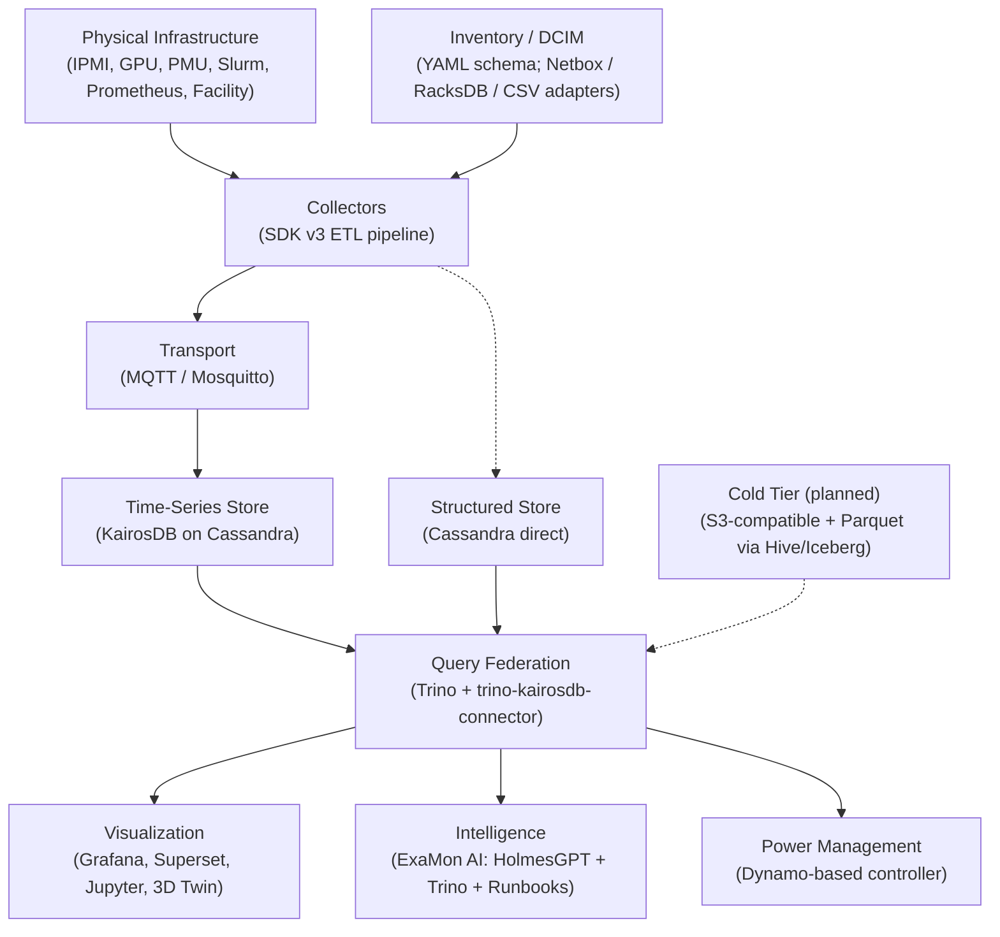

# Architecture

!!! info "Status: Live (reproduced 2026-05-23)"
    Verified against examon-core v0.5.0.

> This page is the long-form walk through the ExaMon stack, layer by layer: what each layer does, the constraints it operates under, and the concrete technology that implements it today. A reader who finishes this page understands the platform well enough to make sensible deployment, integration, and migration decisions.

## The stack at a glance



The same pipeline runs end-to-end on every deployment. Variation between sites lives in the inventory (what hardware exists, which publishers run where) and in which optional components are installed, not in the shape of the data flow.

## 1. Inventory

A monitoring system cannot install itself if it does not know what exists. The inventory layer is the structured description of the physical infrastructure: nodes, racks, clusters, their roles, the monitoring interfaces available on each. Without an inventory, deploying ExaMon at a new site requires a human expert who translates topology into publisher configurations by hand. The inventory turns that translation into a deterministic step.

ExaMon defines its own YAML inventory schema as the internal contract. External DCIM tools (Netbox, RacksDB, CSV exports, hand-edited YAML) populate the schema through thin adapters. Every consumer that needs to know what exists (the publisher scheduler, the 3D Digital Twin, the AI agent, the power-capping controller) reads from the same schema. The advantage of an internal schema over direct DCIM integration is that the consumers do not have to wait for any specific DCIM tool to be installed; they always have an inventory to read.

The current schema design is in active development. The first user is the 3D Digital Twin's parametric model: an inventory entry describes where each mesh belongs and which metric drives its colour, so a new site is added by dropping a glTF model and the matching inventory section.

## 2. Collectors

Sources expose data through dozens of protocols: IPMI/BMC out-of-band sensors, in-band CPU performance counters, vendor GPU libraries, cluster schedulers, Prometheus exporters. The collector framework defines the contract between these sources and the rest of ExaMon. Its design determines how easy it is to add a new source and how reliably data flows when sources fail intermittently.

The current framework is SDK v3 (`examon-base-plugin`, MIT). It formalizes collection as a three-stage ETL pipeline. Extract workers connect to data sources and produce raw data. Transform workers convert raw data into ExaMon's metric format. Load workers write to backends (MQTT, KairosDB, Cassandra, or a debug logger). Each stage runs in its own worker pool, restartable independently, with exponential-backoff retry; the pipeline can run as separate OS processes for GIL isolation or as threads inside one process for lower overhead.

The publisher entry point is four lines of Python; everything else is YAML. Two production-grade implementations validate the framework end-to-end:

- **`prometheus_pub`** ingests from any Prometheus-compatible endpoint (Prometheus servers, DCGM, node_exporter, cAdvisor). Because Prometheus is the dominant metrics standard, this single publisher absorbs hundreds of upstream exporters without ExaMon writing a dedicated publisher for each.
- **`mqtt2kairosdb-v3`** is the MQTT-to-storage bridge that runs inside core. It ships with two interchangeable Load workers: `KairosDBBatchLoader` (production today) and `TDengineBatchLoader` (the first proof that the backend abstraction works in practice; the YAML changes, the Extract and Transform stages do not).

Legacy collectors (`ipmi_pub`, `nvml_pub`, `pmu_pub`, `slurm_pub`) still run in production and are migrated to SDK v3 as the migration backlog clears. The framework deliberately has near-zero dependencies because collectors run on service nodes with restricted Python environments.

## 3. Transport

Collectors run on service nodes or directly on compute nodes. Storage runs on dedicated infrastructure. Between them, data moves asynchronously through a publish-subscribe broker.

The transport layer decouples producers from consumers. A new consumer (a live anomaly detector, a debug subscriber, a secondary storage backend) attaches to MQTT without modifying any publisher. The broker is Mosquitto, an Eclipse Foundation project with a small footprint suitable for sharing infrastructure with other services. ExaMon's topic structure encodes routing information directly in the path:

```
org/<organization>/plugin/<plugin_name>/chnl/<channel>/<metric_name>
```

A subscriber filters by topic prefix without needing a schema registry. The payload is `value;unix_timestamp` to keep per-message overhead near zero.

Mosquitto is single-process and is not horizontally scalable; for a single-cluster deployment with hundreds of nodes this is not a constraint. At very high ingestion rates or multi-cluster aggregation, Kafka becomes the right complement (MQTT at the edge, Kafka for inter-cluster aggregation). Kafka is not on the current roadmap.

## 4. Time-series store

The majority of ExaMon data is time series. The store must handle two workloads at once: high-throughput writes from collectors (potentially thousands of data points per second per cluster) and time-range reads from dashboards, queries, and the AI agent. The schema-less property is non-negotiable: the set of metrics published by a new publisher is not known at deploy time, and migrations on every collector addition would be operationally prohibitive.

The current implementation is KairosDB on Cassandra. KairosDB provides the time-series HTTP API and the tag-based index; Cassandra provides distributed storage, replication, and durability. The two-layer design is a consequence of KairosDB's architecture (it does not manage its own storage). On Kubernetes, Cassandra runs as a 3-node StatefulSet managed by the K8ssandra operator, which handles cluster topology, automated repair (Reaper), backup and restore (Medusa), and TLS.

KairosDB is under low-cadence but active maintenance; ExaMon currently runs the 1.2.x line and tracks the 1.4.x beta for the Cassandra 4.x compatibility improvements. The KairosDB HTTP API is not OpenTSDB-compatible despite shared origins; ExaMon is coupled to the KairosDB API specifically, which is the relevant fact for any future migration.

A TDengine bridge has been built and is in operational use as a second time-series backend, validated through the `TDengineBatchLoader` in `mqtt2kairosdb-v3`. TDengine is positioned as a possible TSDB replacement only; it does not replace Cassandra's role as the structured-data store (see §5) and does not match Cassandra's enterprise features (masterless HA, zone-aware replication, multi-DC native, K8s operator maturity) that procurement requires in HPC contexts.

## 5. Structured store

Not all ExaMon data is time series. Slurm job accounting records are relational: a job has a start, end, user, partition, allocated nodes, exit code, memory usage, energy consumption. Infrastructure metadata is tabular. These records are written once and read in batch for analysis.

ExaMon stores this data directly in Cassandra, in a separate keyspace from KairosDB's tables. The `slurm_pub` publisher writes job records via CQL, bypassing KairosDB. Cassandra's wide-column model accommodates varying job record fields without schema migrations (new columns appear at write time). Its replication and consistency model provides the HA requirement.

The architectural payoff of the dual use of Cassandra is that the entire ExaMon data estate lives in a single Cassandra cluster. Trino can join time-series data (through the KairosDB connector) with job accounting (through the Cassandra connector) in a single SQL query.

## 6. Query federation

ExaMon data lives in at least two stores today (KairosDB on Cassandra, Cassandra direct) and a third tier is planned (S3-compatible object store, Parquet). A user or AI agent should not need to know which store holds which data, or how to write queries in three different languages.

Trino provides the single SQL endpoint. Three connectors cover the stores:

| Connector | What it accesses | Origin |
|---|---|---|
| [`trino-kairosdb-connector`](https://github.com/ExamonHPC/trino-kairosdb-connector) | KairosDB time-series data | Custom (ExaMon, Apache-2.0). |
| Trino Cassandra connector | Direct Cassandra tables (job accounting, metadata) | Trino ecosystem (built-in). |
| Trino Hive / Iceberg connector | Cold-tier S3 / Parquet | Trino ecosystem (built-in). Cold tier is planned, not yet shipped. |

The custom KairosDB connector pushes aggregation down to KairosDB (`avg`, `sum`, `min`, `max`, `count`, `percentile`, and the rest of KairosDB's native aggregators) so raw data does not move across the network just to be reduced. It also splits long time ranges into configurable chunks for parallel execution across Trino workers.

The federation layer is the seam that isolates downstream consumers from storage choices. A migration from KairosDB to a different time-series database adapts the connector; Superset dashboards, Power BI reports, Jupyter notebooks, and AI runbooks keep working unchanged. A migration of the cold tier adds a new connector; the existing two are unaffected.

A reasonable question is whether Trino is still needed if a future TSDB ships its own SQL engine (TDengine, InfluxDB 3, IoTDB all do). The answer is yes: a TSDB's SQL engine can only query its own data, while Trino joins time-series, structured, and cold-tier data in a single query. The cross-store join is the operationally interesting case.

## 7. Cold tier (planned)

Cassandra is optimized for low-latency point reads and high-throughput writes. Its cost model (RAM caching, SSD storage, replication factor 3) makes it expensive for data that is rarely accessed. Monitoring data older than a few weeks is almost never queried for real-time operations; it is read in batch for long-term analysis or model training.

The target architecture introduces a third data tier. Data ages out of KairosDB on Cassandra to an S3-compatible object store after a configurable retention window, serialized as Parquet. Trino's Hive or Iceberg connector queries the cold tier transparently; the tiering is invisible to the SQL caller. The S3-compatible backend is deployment-specific: MinIO for small sites, Ceph or vendor object stores at scale.

The cold tier is in development as part of the v0.5.0 line.

## 8. Visualization

No single tool covers every visualization need. Operators want real-time dashboards with alerting. Analysts want ad-hoc SQL. Researchers want programmatic access from Python. Facility managers want a spatial view of the data center. ExaMon's visualization layer is a stack of tools, each targeting a specific user pattern, all reading from the same data through Trino or KairosDB.

| Tool | Audience | Pattern |
|---|---|---|
| Grafana | Operators | Fixed dashboards, real-time, alerting. Auto-provisioned KairosDB datasource and a bundled test dashboard ship with the chart. |
| 3D Digital Twin (Grafana panel plugin) | Operators, facility managers | Spatial view of the data center, metric-driven mesh colouring, click-through drill-down. Babylon.js renderer with glTF model loading. The original proof-of-concept measured an approximately 8% PUE reduction at a production site through cooling-set-point optimization. |
| Apache Superset | Analysts | Ad-hoc SQL over Trino, web-based chart builder. |
| Jupyter notebooks | Researchers | Python-first, pandas DataFrames, ML pipelines. The [Monte Cimone notebook](../community/clusters/montecimone-notebook.ipynb) is the public reference. |
| Power BI | BI analysts | Enterprise BI dashboards over Trino. |

## 9. Intelligence

At scale, monitoring data outpaces human ability to read it. A cluster with hundreds of nodes generates millions of data points per hour; threshold alerts catch known failure modes and miss novel ones. The intelligence layer inverts the interaction model: instead of the operator watching the data, the data answers the operator's questions.

ExaMon AI (`pip install examon-ai`) is a discovery-driven analytics agent built on three pieces:

- **HolmesGPT** as the agent framework (tool calling, multi-step reasoning, session management). HolmesGPT is a CNCF Sandbox project with active development.
- **Trino** as the query execution layer. Every data retrieval the agent performs goes through the same SQL endpoint a human analyst would use. The agent never touches KairosDB or Cassandra directly.
- **Runbooks and tools** as the agent's domain knowledge. Runbooks (Markdown files) teach the LLM *how to think* about an investigation; tools (Python scripts) generate syntactically and semantically correct SQL. The LLM parameterizes tool calls rather than writing raw SQL, which eliminates the hallucinated-SQL failure class.

The LLM is deployed locally. HPC operational data does not leave the site. The agent is model-agnostic (any OpenAI-compatible endpoint works: Ollama, vLLM, LiteLLM, cloud APIs) and infrastructure-agnostic (the same agent runs on any ExaMon deployment by editing environment variables that point at the local catalog and schema names).

The system is in beta and runs on a production cluster. Demonstrated capabilities include cross-metric time-series comparison, job-failure root-cause analysis, and deep GPU health analysis that has surfaced hardware errors not visible in any existing dashboard.

A separate causal-inference path connects ExaMon's data to the pyWhy library for causal discovery (which variables influence which others, in what direction). The causal path is a proof-of-concept today.

## 10. Power management

GPU-dense HPC clusters face a hard physical constraint: power delivery has a fixed capacity, and exceeding it trips breakers and causes outages. Conservative provisioning wastes capacity; aggressive provisioning risks failure. Dynamic power capping monitors actual power draw continuously and, when consumption approaches the limit, selectively reduces power to lower-priority workloads to keep the total within budget.

ExaMon's power management layer is a proof-of-concept controller based on Facebook/Meta's Dynamo architecture (ISCA 2016), validated against real CINECA Marconi 100 data. It reads current power from ExaMon's data layer through the same SQL interface used by dashboards. A priority-based policy engine decides which nodes to cap and which to uncap, and a control loop applies the limits via RAPL (CPU), NVML (GPU), or IPMI (system-level). The controller is intentionally a separate deployable so sites that do not need power capping do not run it.

## 11. Deployment and orchestration

ExaMon is a distributed system with stateful and stateless components. Deployment is declarative, reproducible, and environment-aware. The v0.4.0 path was Docker Compose with a monolithic supervisord container; the v0.5.0 path is Kubernetes with one workload per service. Both remain supported today; the Kubernetes path is the recommended target for any new deployment.

The v0.5.0 Helm chart uses an umbrella pattern with subcharts per component and environment-specific value overrides for local, staging, and production. Cassandra runs as a 3-node K8ssandra StatefulSet, KairosDB as a multi-replica Deployment, Mosquitto as a StatefulSet, Grafana as a PVC-backed Deployment, and the stateless bridge services as Deployments. Ingress routes `/grafana` to Grafana and `/api` to the ExaMon API server.

Additional components (the connector, the 3D plugin, the AI agent, the power controller) ship from their own repositories and plug into the same namespace or Docker network as core. The integration mechanics for each are documented inside that component's own installation pages rather than abstracted here.

## Where next

- [Deployment topology](../administrators/deploy/topology.md): the v0.4.0-to-v0.5.0 deployment shapes with concrete diagrams.
- [Quickstart](../get-started/quickstart.md): bring the stack up locally to see the architecture concretely.
- [Component catalog](../reference/component-catalog.md): every component with status and source repository in one table.

---

## Source

- ExaMon source repository: [ExamonHPC/examon](https://github.com/ExamonHPC/examon) (release/v0.5.0).
- Trino-KairosDB connector: [ExamonHPC/trino-kairosdb-connector](https://github.com/ExamonHPC/trino-kairosdb-connector).
- ExaMon ETL framework: [`examon-base-plugin`](https://github.com/ExamonHPC/) (SDK v3, MIT).
- Reference dataset: Borghesi, A., Bartolini, A., Lombardi, M. *et al.* M100 ExaData. *Scientific Data* 10, 288 (2023).
