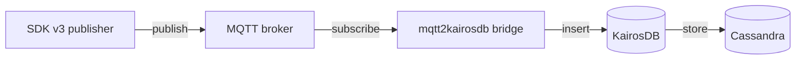

# Data Model

!!! info "Status: Live (reproduced 2026-05-23)"
    Reproduced from the ExaMon Data Model specification authored alongside the SDK v3 (`examon-base-plugin`) reference implementation. The authoritative reference is cited at the bottom of this page.

> The ExaMon data model is the contract every component honours: publishers, the MQTT broker, the bridge, KairosDB, Cassandra, the Trino federation layer, and every downstream consumer. The model is intentionally **hierarchical, tag-centric, and transport-agnostic**, designed to carry monitoring data from large heterogeneous fleets (HPC nodes, GPUs, BMCs, schedulers, and any sensor that fits the same shape) without a centralized schema service. This page covers the model end to end, independent of any specific deployment shape.

## Core entities

Every observation in ExaMon is a single **metric sample**, defined by four parts:

| Part | Description | Example |
|---|---|---|
| **Metric name** | What is being measured. Stable, semantically meaningful, source-derived. | `p0_power`, `cpu_idle`, `temperature.gpu`, `aperf`, `plugin_output`, `state` |
| **Value** | The observed value at the timestamp. **Numeric or string.** | `25.1`, `10822010350093`, `"Node unavailable due to maintenance"` |
| **Timestamp** | When the value was collected. Single timestamp per value. | `1658832078.001` (seconds with millisecond precision on the wire) |
| **Tags** | Ordered set of key/value pairs contextualizing the metric. | `org=cineca, cluster=marconi100, node=r255n18, plugin=ipmi_pub, chnl=data` |

Values can be **numeric** (int, float) or **string** (log lines, scheduler commands, Nagios admin notes). The transport encodes everything as a string and the storage layer or client library parses it back to the appropriate type. This is what lets ExaMon carry both `total_power=482.3` and `plugin_output="DISK CRITICAL - free space: 0 MB"` through the same pipeline without a discriminator.

## The tag hierarchy and sensor identity

Tags are the primary mechanism for **encoding context** and **organizing metrics hierarchically**. The convention divides tags into four ordered sections:

| # | Section | Mandatory | Common keys |
|---|---|---|---|
| 1 | **Sensor location** | Yes (at least one) | `org`, `cluster`, `rack`, `node`, `slot` |
| 2 | **Plugin name** | Yes | `plugin` |
| 3 | **Channel type** | Yes | `chnl` (values: `data` for metric values, `cmd` for commands sent to the sensor or plugin) |
| 4 | **Plugin-specific** | No | `host_group`, `state_type`, `description`, `core_id`, `socket_id`, ... |

!!! abstract "Sensor identity rule"
    A sensor is **fully defined when there is a unique path from the top to the bottom of this hierarchy**. For a given sensor, each tag key has exactly one value. Changing any tag value identifies a different metric series.

This rule is the spine of the model. It is what makes a `WHERE node = 'r255n18' AND plugin = 'ipmi_pub'` filter unambiguous across an entire fleet, what makes a metric stream addressable through an MQTT subscription, and what defines the primary key in the storage layer.

The convention is to set the canonical tags once per publisher (in `global.examon.tags` in the SDK v3 configuration; see [Developers → SDK v3](../developers/sdk-v3/index.md#global)) so every emitted sample inherits the location + plugin + channel block without per-call boilerplate.

### Example tag set

For an IPMI publisher running on a Marconi 100 node:

```yaml
org: cineca
cluster: marconi100
node: r255n18
plugin: ipmi_pub
chnl: data
```

A PMU publisher on the same node, scoped to one CPU core, would add a plugin-specific tag:

```yaml
org: cineca
cluster: marconi100
node: r255n18
plugin: pmu_pub
chnl: data
core: 23
```

Both publishers emit through the same broker, the same bridge, the same storage; only the tag set differs. The bridge needs no per-plugin configuration.

## Transport: MQTT topics and payloads

The data model maps naturally onto MQTT's topic hierarchy. The shape is **alternating `key/value` segments** that mirror the tag hierarchy, with a mandatory plugin-and-channel block in the middle and the metric name as the last segment.

!!! abstract "ExaMon topic pattern"

    ```
    <key>/<value>/...  /plugin/<plugin_name>/chnl/<data|cmd>/  <key>/<value>/...  /<metric_name>
    ```

    | Block | Required | Description |
    |---|:---:|---|
    | Sensor location (key/value pairs) | yes | At least one location key/value, often several for precise identification. |
    | `plugin/<plugin_name>/chnl/` then `data` or `cmd` | yes | Plugin identifier and channel type. |
    | Plugin-specific (key/value pairs) | no | Additional per-plugin dimensions (per-core, per-DIMM, per-GPU, etc.). |
    | Metric name | yes | The last segment. |

Concrete example, from the SDK v3 reference implementation of `pmu_pub`:

```
org/testorg/cluster/testcluster/node/testnode00/plugin/pmu_pub/chnl/data/core/23/aperf
```

Parsed by the bridge:

| Tag key | Value |
|---|---|
| `org` | `testorg` |
| `cluster` | `testcluster` |
| `node` | `testnode00` |
| `plugin` | `pmu_pub` |
| `chnl` | `data` |
| `core` | `23` |

Metric name: `aperf`.

Because the keys are present in the topic alongside their values, the bridge can decode every subscribed topic without per-plugin configuration. A new publisher with a new tag layout can be deployed without touching the bridge.

### Reserved characters

MQTT reserves four characters that must not appear unencoded in a topic segment. When a tag value or metric name needs to contain one, it is URL-encoded:

| Character | Description | URL encoding |
|---|---|---|
| `/` | Forward slash | `%2F` |
| `#` | Hash | `%23` |
| `+` | Plus | `%2B` |
| ` ` | Space | `%20` |

The `mqtt2kairosdb` bridge decodes these on the way to storage. The SDK v3 `MQTTLoader` worker has a `sanitize_topic` setting (default `true`) that applies the encoding on the publish side.

### Payload format

The default payload is a CSV string concatenating the value and the timestamp:

!!! abstract "ExaMon payload pattern (CSV)"

    ```
    <value>;<timestamp>
    ```

    | Field | Mandatory | Description |
    |---|:---:|---|
    | Value | yes | The observed value, string-encoded. |
    | `;` | yes | Separator. |
    | Timestamp | yes | UNIX seconds with millisecond precision (e.g. `1658832078.001`). |

For the topic example above:

```
10822010350093;1658832078.001
```

Consumer steps: parse the string, split at `;`, convert value and timestamp to the appropriate types. The minimal payload keeps the bridge lightweight: metadata (tags, metric name) is entirely in the topic; the payload carries only the time-varying data.

Alternative payload formats (JSON, binary) are part of the model specification and reserved for future use; the CSV form is the one shipped today.

## Storage: KairosDB and Cassandra

ExaMon's storage layer is **KairosDB on top of Apache Cassandra**.



In KairosDB, a metric is identified by `metric_name` plus its set of tag key/value pairs. Values and timestamps are stored as data points in the row identified by that combination. The Cassandra primary key concatenates `metric_name` and tag values, enabling efficient per-metric and per-tag filtering, horizontal scalability across nodes, and fast writes for high-frequency monitoring data.

### Bridge output: MQTT to KairosDB JSON

The `mqtt2kairosdb` bridge subscribes to the MQTT broker, parses each topic into metric name and tags, parses each payload into value and timestamp, and writes the result as KairosDB JSON. The conversion for the topic example above:

```json
[
  {
    "name": "aperf",
    "timestamp": 1658832078001,
    "value": 10822010350093,
    "tags": {
      "org": "testorg",
      "cluster": "testcluster",
      "node": "testnode00",
      "plugin": "pmu_pub",
      "chnl": "data",
      "core": "23"
    }
  }
]
```

| Field | Source | Description |
|---|---|---|
| `name` | Last segment of the MQTT topic | Metric name. |
| `timestamp` | MQTT payload | Unix epoch in **milliseconds** (integer). The bridge converts from the CSV seconds-decimal form. |
| `value` | MQTT payload | Numeric or string. |
| `tags` | MQTT topic | Every key/value pair extracted from the topic path. |

KairosDB also accepts a compact batch form that groups multiple `[timestamp, value]` pairs for the same metric and tag set:

```json
[
  {
    "name": "aperf",
    "datapoints": [
      [1658832078001, 10822010350093],
      [1658832079001, 10822010350127],
      [1658832080001, 10822010350189]
    ],
    "tags": { "org": "testorg", "cluster": "testcluster", "node": "testnode00",
              "plugin": "pmu_pub", "chnl": "data", "core": "23" }
  }
]
```

The single-data-point JSON schema is also the default **internal data format** for SDK v3 publishers: a worker passes samples to the next stage as KairosDB-shaped dicts, which keeps the in-process pipeline aligned with the on-wire storage format.

## Structured data alongside time-series

Not every ExaMon dataset fits the time-series shape. Job-scheduler records (Slurm `job_info`, accounting fields) are stored as **per-job rows in dedicated Cassandra tables**, with columns covering identity (`job_id`, `user_id`, `account`), lifecycle (`submit_time`, `start_time`, `end_time`, `run_time`), resource requirements (`num_nodes`, `num_cpus`, `partition`, `qos`), and runtime behaviour (`exit_code`, `job_state`, `state_reason`). These records are written directly to Cassandra by their producers (typically a `slurm_pub` collector), not through the MQTT + KairosDB path.

The structured and time-series stores share the same Cassandra cluster: KairosDB writes to its own keyspace, and the structured tables live in their own. The federation layer (Trino) connects to both and `JOIN`s across them on shared tags (`cluster`, `node`) and time ranges; see [Users → Analyze](../users/analyze/index.md) for the SQL-side view.

## Discovery

Because the model is schema-less on the time-series side, consumers need a way to learn what metrics exist for a given cluster, node, or plugin. ExaMon's discovery convention is two-layered:

| Layer | Mechanism |
|---|---|
| **Direct** | KairosDB's `/api/v1/metricnames` endpoint lists every metric the store has seen. Combined with `/api/v1/datapoints/query/tags`, this answers "what metrics and tag values exist on this deployment". |
| **Cached** | A per-cluster registry table in Cassandra (commonly `row_keys`) holds the mapping of metric name to publisher to tag shape. Faster lookups than scanning KairosDB; used by the federation layer and by [ExaMon AI](../users/ai/index.md) for runtime discovery. |

This convention is what lets a new ExaMon AI deployment, or a new BI integration, be pointed at a cluster and start producing useful queries without manual schema input.

## Design properties

The properties that fall out of the model:

| Property | Why it matters |
|---|---|
| **Schema-less ingest** | A new publisher, a new node, or a new metric starts producing data immediately. No coordinated schema migration. |
| **Schema travels with the data** | The MQTT topic carries both keys and values; any consumer can decode it without a centralized registry. |
| **Storage-agnostic** | KairosDB today; the SDK v3 framework ships a `TDengineBatchLoader` alongside `KairosDBBatchLoader`, proving the abstraction. The model does not bind to one backend. |
| **Transport-agnostic** | MQTT today; the same model serializes to any pub/sub or batch transport that can carry a key/value path and a tagged payload. |
| **Tag-as-filter on read** | Every storage and query surface (KairosDB, Cassandra, Trino) uses the same tag set for predicate pushdown. |
| **Stable across versions** | The model on the wire is the v0.4.0-era contract; v0.5.0 changed the publisher framework (SDK v3) and added the federation layer (Trino), not the data model. A v0.4.0 publisher emits samples the v0.5.0 stack ingests correctly. |

## Trade-offs

The model is deliberately permissive. The costs are:

- **No global metric registry.** Consumers cannot rely on a metric existing; the discovery convention exists precisely because of this.
- **No schema enforcement at the broker.** Invalid tag layouts can be published; the bridge tolerates them but the resulting series may be hard to query.
- **Topic design discipline matters.** Inconsistent tag keys across publishers (e.g. `nodename` vs `node`) fragment the addressable surface. The canonical-tag convention exists to prevent this.

The best-practice guidance for new publishers and integrations (semantic metric names, context-in-tags rather than context-in-metric-names, query-oriented tag keys, unique-and-stable tag combinations, aligned MQTT topics) is documented in the SDK v3 reference, cited below.

## Related reading

- [Concepts → Architecture](architecture.md): where the data model fits inside the full stack.
- [Concepts → Plugin model](plugin-model.md): the producer side, covering how SDK v3 publishers shape and ship samples.
- [Users → Analyze](../users/analyze/index.md): the consumer side, including the Trino federation view and the legacy `examon-client` Python path.
- [Reference → Configuration](../reference/configuration.md): the parameter surface for tags, MQTT topic shape, and the bridge.

---

## Source

- ExaMon Data Model specification (authoritative): the [ExaMon Data Model](https://docs.google.com/document/d/1QePNvI5kMCYeOX5PnoCk9IwrzRFBZgZkPdbS2P45E_8/edit?usp=sharing) reference; this page is a conceptual reproduction of that document.
- The same spec ships inside the SDK v3 (`examon-base-plugin`) repository documentation, the canonical version of which will be promoted as a public reference alongside the SDK v3 release.
- KairosDB upstream documentation: [KairosDB project site](https://kairosdb.github.io/).
- Bridge implementation: [`deploy/docker/mqtt2kairosdb/`](https://github.com/ExamonHPC/examon/tree/release/v0.5.0/deploy/docker/mqtt2kairosdb) in the core repository.
